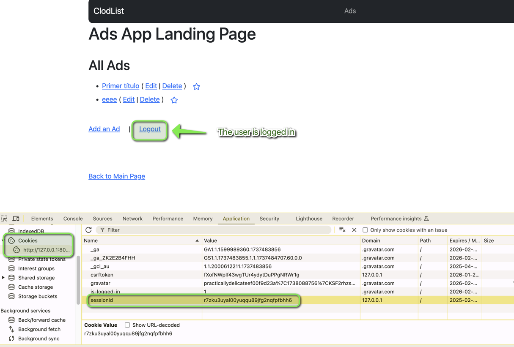
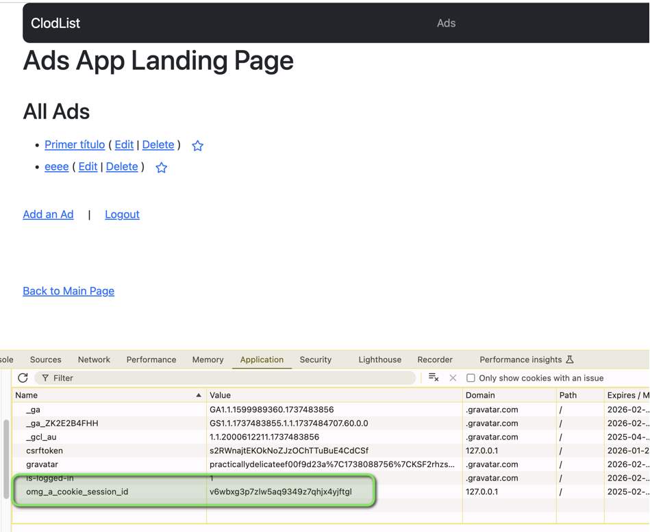

# **DjangoForEverybody**

**IMPORTANT**:
All the code belongs to:
Michigan University's Django for Everybody https://online.umich.edu/series/python-for-everybody/
by Dr. Charles Severance
I just added an insane ammount of comments for me to understand each and every detail of what's going on in there, and I made some extremely minor changes to the code (added a few links here and there to make navigarion between apps more easy).

SqLite3 superuser credencials are:

* **username:** admin  
* **password:** admin

Where did those come from?

Easy:

After creating the migrations (to create the necessary files in the database) do:


```language
% python manage.py createsuperuser
```


And to launch the server:


```language
% python manage.py runserver                 # Default localhost:8000  
% python manage.py runserver 8080            # Custom port  
% python manage.py runserver 0.0.0.0:8000    # Allow external access
```


Django administration console is at: http://127.0.0.1:8000/admin

Apps are created with:


```language
% python manage.py startapp                 # is the name of the app

```

add the apps themselves to mysites/settings.py

add the localization of the apps to mysite/urls.py

In that file you will find:


```language
urlpatterns = [  
    # The line below defines the default page for the site  
    # The exact page is defined in the home app in mysite/home/urls.py  
    path('', include('home.urls')),  
    . . .  
]
```


therefore, the Home screen is:

mysite/home/templates/home/main.html

as defined in the home app in mysite/home/urls.py:


```language
urlpatterns = [  
    # The page is defined in the home app in mysite/home/views.py  
    # by the HomeView class  
    path('', views.HomeView.as_view()),  
]
```

The login page is defined in the home app in mysite/home/templates/home/main.html

mysite/home/templates/registration/login\_social.html

Authentication:

* **Django Authentication URLs**:  
  * The `django.contrib.auth.urls` module provides a set of default views for handling authentication tasks. By including these URLs, you enable features like login, logout, password change, and password reset without having to write the views yourself.  
  * The `path('accounts/', include('django.contrib.auth.urls'))` line maps the URL pattern `'accounts/'` to these authentication views. For example, the login page would be accessible at `http://127.0.0.1:8000/accounts/login/`.  
* **Social Authentication URLs**:  
  * The `social_django` package integrates social authentication providers like Google, Facebook, and Twitter into Django. By including `social_django.urls`, you enable users to log in using their social media accounts.  
  * The `re_path(r'^oauth/', include('social_django.urls', namespace='social'))` line maps the URL pattern `'oauth/'` to the social authentication views. The `namespace='social'` parameter allows you to reference these URLs using the `social` namespace.  
    

In file:


```language
mysite/mysite/github\settings.py
```


you need to add the credentials provided by GitHub


```language
SOCIAL_AUTH_GITHUB_KEY = 'xxxxxxxxxxxxxxxxxxxx'  
SOCIAL_AUTH_GITHUB_SECRET = 'xxxxxxxxxxxxxxxxxxxxxxxxxxxxxxxxxxxxxxxxx'
```


# Cross-Site Request Forgery

CSRF stands for Cross-Site Request Forgery. It is a security feature implemented in web applications to protect against malicious attacks where an unauthorized command is transmitted from a user that the web application trusts. This is particularly important for web applications that allow users to perform actions that change the state of the application, such as submitting forms or making purchases.

### **How CSRF Works**

1. **Token Generation**: When a user loads a page that contains a form (e.g., a login form), the server generates a unique CSRF token and includes it in the form as a hidden field. This token is typically stored in the user's session.  
2. **Token Submission**: When the user submits the form, the CSRF token is sent along with the form data.  
3. **Token Validation**: When the server receives the form submission, it checks the submitted CSRF token against the token stored in the user's session. If the tokens match, the request is considered valid and is processed. If the tokens do not match, the request is rejected, indicating a potential CSRF attack.

### **CSRF Token in Django**

In Django, the CSRF token is automatically included in forms rendered using Django's templating system. You can manually include the CSRF token in your templates using the  template tag.

### **Example Usage in a Form**

Both:

* mysite/home/templates/registration/login\_social.html  
* mysite/home/templates/registration/login.html

use siad tag.

In these examples:

* ``: This template tag inserts a hidden input field with the CSRF token. When the form is submitted, this token is sent along with the form data.  
* The server validates this token to ensure the request is legitimate.

### **CSRF Middleware**

Django includes middleware to handle CSRF protection. By default, Django's CsrfViewMiddleware is included in the `MIDDLEWARE` setting in settings.py:


```language
MIDDLEWARE = [  
    'django.middleware.security.SecurityMiddleware',  
    'django.contrib.sessions.middleware.SessionMiddleware',  
    'django.middleware.common.CommonMiddleware',  
    'django.middleware.csrf.CsrfViewMiddleware',  
    'django.contrib.auth.middleware.AuthenticationMiddleware',  
    'django.contrib.messages.middleware.MessageMiddleware',  
    'django.middleware.clickjacking.XFrameOptionsMiddleware',  
    'social_django.middleware.SocialAuthExceptionMiddleware',    
]

```

### **CSRF Exemptions**

In some cases as in **`class AddFavoriteView(LoginRequiredMixin, View)`**you might need to exempt certain views from CSRF protection. This can be done using the `csrf_exempt` decorator:


```language
from django.views.decorators.csrf import csrf_exempt  
from django.http import JsonResponse

@method_decorator(csrf_exempt, name='dispatch')  
class AddFavoriteView(LoginRequiredMixin, View):  
    def post(self, request, pk) :  
         .  .  .  
        return HttpResponse()

```

CSRF protection is a critical security measure in web applications to prevent unauthorized commands from being transmitted from a user that the web application trusts. In Django, CSRF tokens are automatically included in forms and validated by middleware to ensure the integrity and security of form submissions.

# Session Management



And if we check the database:

sqlite\> select \* from django\_session;  
ab3vmfgsli92rlccmzv3meq09ujr3t08|.eJxVjEsOwjAMBe-SNYpM4jgpS\_Y9Q-U6DimgVupnhbg7VOoCtm9m3st0vK212xaduyGbi0Fz-t16loeOO8h3Hm-TlWlc56G3u2IPuth2yvq8Hu7fQeWlfmuHicj5SIDAAk4CqwaEhnwmIfBRCgMHFR8bVS0NF1F\_ThlRE4J5fwDI1DfS:1tYUpI:HvXXDJI46k\_yuwMpkFfsp51la5rCjkSJb4GfdvyQyms|2025-01-30 18:42:44.981297  
7gtqc6bg0zm89qu86s7cvlmc2rxdi92g|eyJudW1fdmlzaXRzIjo0fQ:1tb13s:wYi7n8Rb5WMp-0C39pdktup3EdCT-Hrm27cpSahdzYs|2025-02-06 17:32:12.594429  
***r7zku3uyal00yuqqu89jfg2nqfpfbhh6***|.eJxVjM1OhDAURt-lawP9AUrdDTGzm9EYFu7Ive2FIgQmtKiJ8d2FhA3b853z\_bKJfiJ7Zim4kLIn1vXRr9iECJE2\_H2t6-VrxOoi4wp3c3mn4W15qQf\_OuaPj3ErGlijb9ZAS9O7LRFnhmAHmvbBfcLUzYmdp7j0mOxKcqwhuc2OxupwTwcegt9qrXjWUlZak3MtHCitLM8FN1mBRmKrylKRcVqSxqKQUqNouVVgubBGYMb-\_gHngUyU:1tb6H5:5YGd8MUp10eNlino9Ja1lXpVoHuIXt5SzyKSprek2fY|2025-02-06 23:06:11.169973

We can identify the session id.

The name of the session cookie can be configured in:


```language
mysite/mysite/settings.py
```

```language
# Session cookie name  
SESSION_COOKIE_NAME = 'omg_a_cookie_session_id'  
```

 



**Important:**  
If cookies are not enabled in the browser, Django can still function but will operate in a limited mode. You can configure Django to use a different session backend that does not rely on cookies, such as the database backend or cache backend. You can also create custom authentication views that do not rely on cookies. However, keep in mind that disabling cookies can affect the security and usability of your application.

# Use in production

The web server in use for the Django project is not explicitly specified in the `settings.py` file. However, based on common practices and the configuration provided, it is likely that the Django development server is being used. Here are some key points:

1. **WSGI Application**: The `WSGI_APPLICATION` setting in `settings.py` is set to `'mysite.wsgi.application'`. This indicates that the project is configured to use WSGI, which is typically managed by a WSGI-compliant web server.  
2. **Development Server**: The Django development server is a built-in server that comes with Django. It is typically used for development purposes and is started using the `runserver` command. For example:  
     
   python manage.py runserver  
     
3. **Production Server**: For production environments, a more robust WSGI server like Gunicorn, uWSGI, or another WSGI-compliant server is typically used. These servers are designed to handle multiple requests concurrently and are more suitable for production use.  
4. **ASGI Application**: The `ASGI_APPLICATION` setting is not present in the provided `settings.py` file. If asynchronous views or middleware are used, this setting would need to be added to specify the ASGI application.

### **Example Configuration for Production Server**

To use a production server like Gunicorn, you would typically follow these steps:

**Install Gunicorn**:


```language
  pip install gunicorn

```

**Run Gunicorn**:


```language
  gunicorn mysite.wsgi:application --bind 0.0.0.0:8000

```

### **Example Configuration for ASGI Server**

If you plan to use asynchronous views or middleware, you would need to configure the ASGI application and use an ASGI-compliant server like Uvicorn:

**Install Uvicorn**:


```language
  pip install uvicorn

```

**Configure ASGI Application**:  
Add the `ASGI_APPLICATION` setting to `settings.py`:


```language
ASGI_APPLICATION = 'mysite.asgi.application'

```

**Run Uvicorn**:


```language
  uvicorn mysite.asgi:application --host 0.0.0.0 --port 8000

```

### **Conclusion**

The web server in use for the Django project is likely the Django development server, which is suitable for development but not recommended for production. For production, a WSGI-compliant server like Gunicorn or an ASGI-compliant server like Uvicorn should be used.
